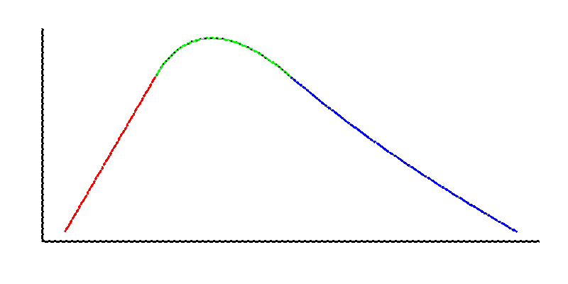

| {: style="width: 200px;"} | {: style="width: 200px;"} |

- [TP1 : Courbes de Bézier - Algorithme de De Casteljau](data/TP1_Beziers_De_Casteljau.zip)
- [TP2 : Courbes de Bézier - Raccord C1 et C2](data/TP2_Raccord_Bezier.zip)
- [TP3 : Courbes B-splines, Algorithme de Deboor-Cox](data/tp3_bspline.pdf)
- [TP4 : Courbes de subdivision](data/TP4_Courbes_Subdivision.zip)
- [TP5 : Spline uniforme](data/TP5_Spline_Uniforme.zip)
- [TP6 : Surface de Bézier](data/TP6_Surface_Bezier.pdf)
- [TP7 : Surface B-spline](data/TP7_Surface_BSpline.zip)
- [TP8 : Surface Subdivision](data/TP8_Surface_Subdivision.pdf)
