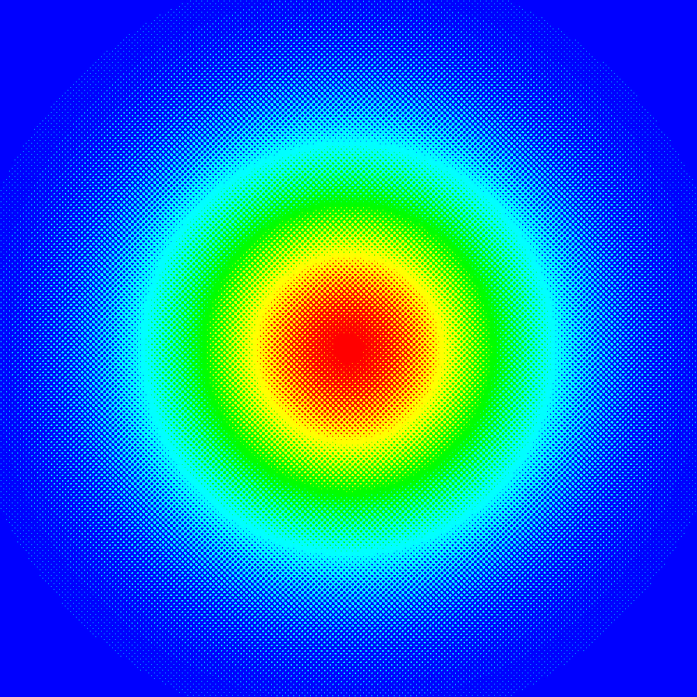
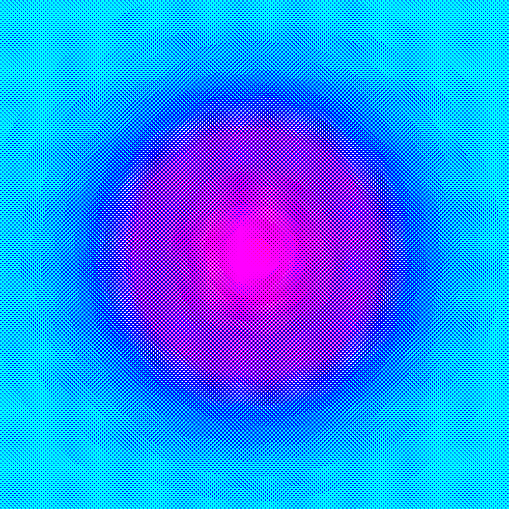
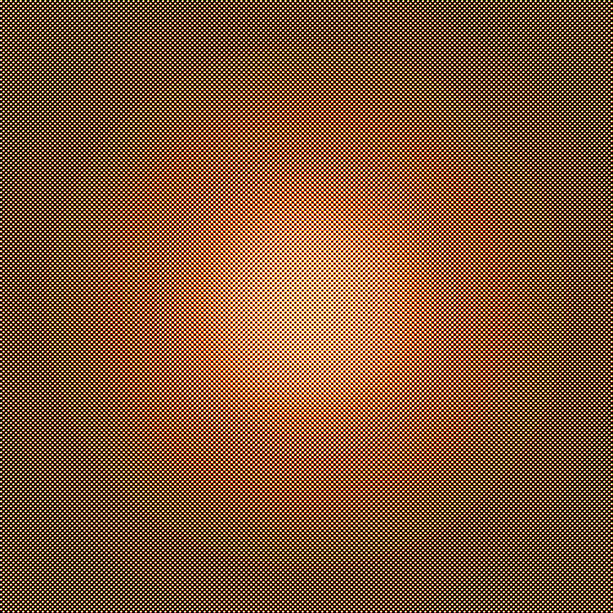

| {: style="width: 200px;"} | {: style="width: 200px;"} | {: style="width: 200px;"} |

- [TP1 : Ondelette de Haar](data/TP1_Subdivision_Ondelette_Haar.zip)
- [TP2 : Subdivision de Chaikin](data/TP2_Subdivision_Chaikin.zip)
- [TP3 : Shepard - Interpolation de données éparses](data/TP3_Scattered_Data_Shepard.zip)
- [TP4 : Marching Square](data/TP4_Marching_Square.zip)
- [TP5 : Color Map](data/TP5_ColorMap.zip)
